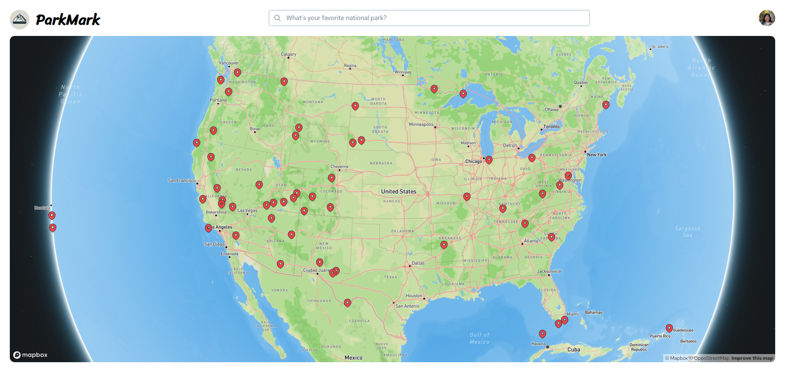
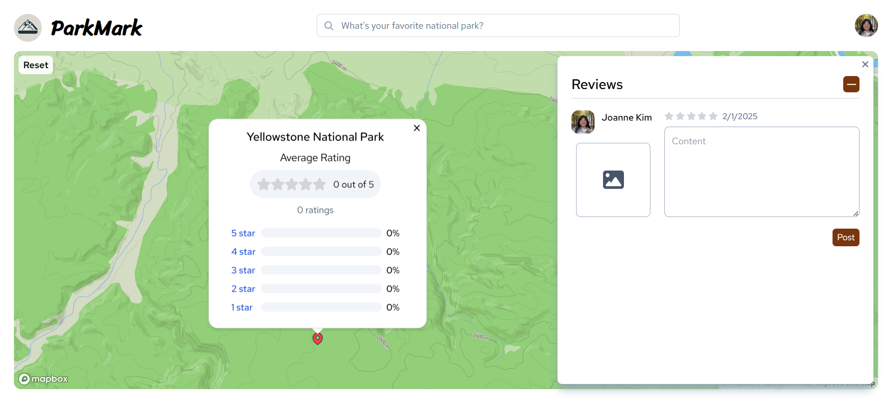

## About Parkmark
Parkmark is an online rating platform for U.S. national parks, built with React and Express.

You can access the website at: [ParkMark](https://parcomolo.vercel.app/) 🌳 :milky_way:

## Preview




## Features
- [x] Interactive map with pins marking U.S. national parks
- [x] Leave reviews out of 5 stars
- [x] Attach image to reviews
- [x] Search bar for selecting desired park
- [x] Login with Google account (OAuth)

## Tech Stack
* Frontend: React
* Backend: Express
* Database: PostgreSQL
* Map Software: [Mapbox](https://www.mapbox.com/) with [react-mapbox-gl](https://visgl.github.io/react-map-gl/) library

## Installation
First, clone the repo:
```sh
git clone https://github.com/joanne5548/parkmark.git
```

### Frontend 
Install dependencies and run the development server:
```sh
cd client
npm install
npm run dev
```

### Backend - Development
Install dependencies for backend and run the development server:
```sh
cd server
npm install
npm run dev
```

### Backend - Production
Backend is deployed on Google Cloud Run with Docker. </br>
To run the production server, run docker:
```sh
cd server
docker build
docker run -p 5000:5000 <image_id>
```

## Directory Structure
1. `/client`
    - Contains frontend application
2. `/server`
    - Contains backend server
    - `/sql_queries`: contains database schema and queries used for its setting and modifications
3. `/scripts`
    - Contains Python scripts for data cleaning and retrieval

## Environment Variables

## Roadmap
- [ ] Create user information page
    - [ ] Include full list of national park tiles that highlights ones that are already reviewed
    - [ ] View past reviews
    - [ ] Tab for liked reviews
- [ ] Allow more than one image upload
- [ ] Allow edits to posts

Note: Previous items can be found at: [PreviousTodoList.md](./PreviousTodoList.md)

## Contact
**Joanne Kim** </br>
[Visit my website!](joannekim.dev) |
[LinkedIn](https://www.linkedin.com/in/jkim0328) </br>
You can reach me at: joanne.kim0328@gmail.com